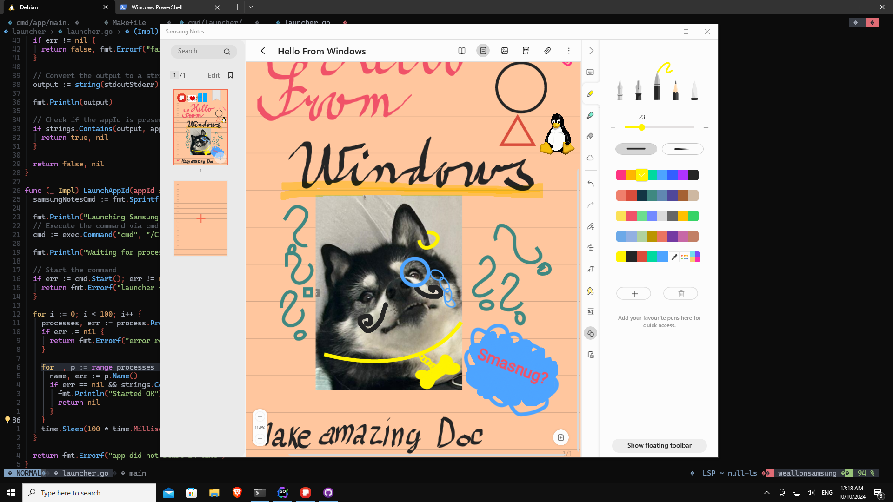

# Smasnug Notes – Run Samsung Notes on Windows

Run **Samsung Notes** on your **Windows PC** with Smasnug Notes, a lightweight launcher that enables Samsung Notes functionality by temporarily modifying your system to resemble a **Samsung Galaxy Book**. This allows Samsung Notes to bypass its device restrictions.

## How to Run Samsung Notes on Windows

Follow these steps to get **Samsung Notes running on your Windows device**:

1. **[Download the Smasnug Notes Launcher here](https://github.com/kubaracek/Smasnug-Notes/releases/download/v0.0.8/Smasnug.Notes.exe)** (Releases page).
2. Launch the Smasnug Notes app. You might encounter a security warning from **Microsoft Defender** due to downloading from the internet. Select **More Info** and click **Run Anyway** to proceed.
3. If you already have **Samsung Notes installed** from the Microsoft Store, the launcher will simply start it up. If not, Smasnug Notes will guide you through the installation process.
4. Once installed, you're all set to use Samsung Notes on your Windows machine!

## How to Download Samsung Notes on Windows

There are two ways to get **Samsung Notes** on your PC:

- Launch `Smasnug.Notes.exe` (downloaded from the guide above or the **Releases page**) to automatically install and configure **Samsung Notes** for your system.
- Alternatively, you can manually install **Samsung Notes** from the **Microsoft Store**.

Please note: **Samsung Notes is device-locked** to Samsung hardware, meaning it won't work on non-Samsung devices without the Smasnug Notes utility.

## License

This program is free software; you can redistribute it and/or
modify it under the terms of the GNU General Public License
as published by the Free Software Foundation; either version 2
of the License, or (at your option) any later version.

This program is distributed in the hope that it will be useful,
but WITHOUT ANY WARRANTY; without even the implied warranty of
MERCHANTABILITY or FITNESS FOR A PARTICULAR PURPOSE.  See the
GNU General Public License for more details.