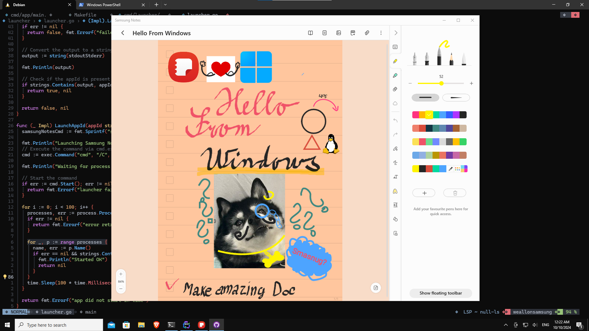

# Smasnug Notes
A lightweight launcher that temporarily disguises your Windows machine as a Samsung Galaxy Book by modifying Windows registry settings during app startup, just for the duration of the system check when Samsung Notes are being launched.

## Installation

1) [Download the Launcher here (Releases page)](https://github.com/kubaracek/SmasnugNotes/releases/download/v0.0.4/weallonsamsung.exe)
2) Start the app. You will be greeted by Microsft Defender asking if you really want to run the app as it's downloaded from the internet. Click **More Info** and **Run Anyway**.
3) If you have Microsoft notes already installed through Microsoft Store, it will just launch, otherwise the Launcher can install it for you.
4) Enjoy!

## License

This program is free software; you can redistribute it and/or
modify it under the terms of the GNU General Public License
as published by the Free Software Foundation; either version 2
of the License, or (at your option) any later version.

This program is distributed in the hope that it will be useful,
but WITHOUT ANY WARRANTY; without even the implied warranty of
MERCHANTABILITY or FITNESS FOR A PARTICULAR PURPOSE.  See the
GNU General Public License for more details.